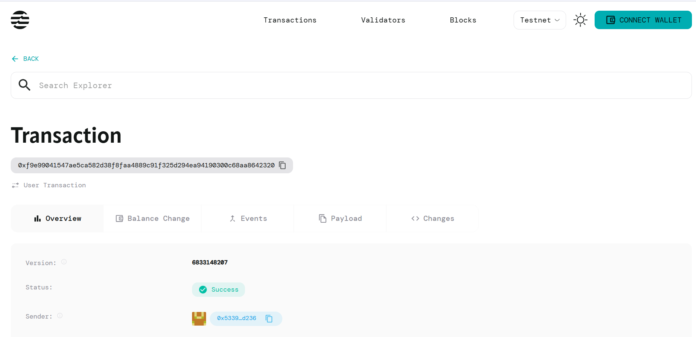

# Token Time Lock

## Project Description
A smart contract system that enables time-locked token transfers with customizable release schedules. Users can deposit tokens that become available to beneficiaries only after a specified time period expires.

## Project Vision
To provide a secure, decentralized solution for time-based token distribution, enabling use cases such as vesting schedules, escrow services, scheduled payments, and trust fund mechanisms on the Aptos blockchain.

## Key Features
- **Time-Based Locking**: Lock tokens for any specified duration
- **Beneficiary System**: Designate different addresses to receive locked tokens
- **Automated Release**: Tokens automatically become claimable after lock period
- **Secure Storage**: Utilizes Aptos Move's resource system for safe token custody
- **Flexible Duration**: Support for any lock duration from seconds to years

## Future Scope
- **Multi-Release Schedules**: Support for vesting with multiple unlock dates
- **Partial Releases**: Allow percentage-based token releases over time
- **Revocation Features**: Enable depositors to cancel locks under certain conditions  
- **Multi-Token Support**: Extend beyond AptosCoin to any token type
- **Governance Integration**: Add DAO voting mechanisms for lock modifications
- **Analytics Dashboard**: Web interface for tracking and managing time locks

## Contract Details
0xf9e99041547ae5ca582d38f8faa4889c91f325d294ea94190300c68aa8642320
